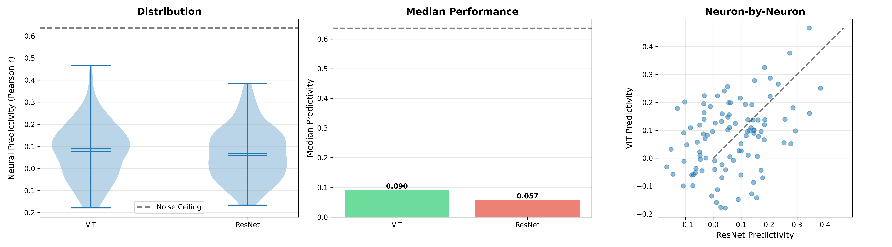
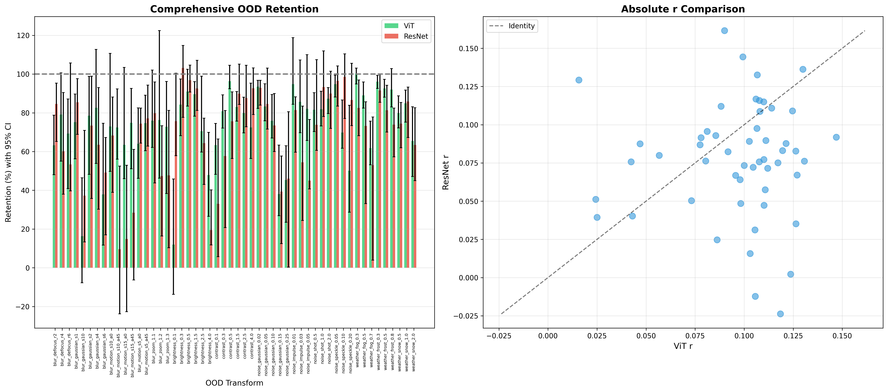

# OOD Neural Alignment: ViT vs ResNet

**Ambar** 

Following the methodology from Madan et al. (2024), I tested whether Vision Transformers and ResNets show different out-of-distribution degradation patterns when predicting V1 neural responses.

## Quick Start

```bash
# 1. Clone/download this repository
cd ood-neural-alignment

# 2. Install dependencies, Allen Observatory Data, and setup virtual environment
chmod +x install.sh
./install.sh

# 3. Run the analysis
python base_neural_analysis.py      # Baseline neural predictivity
python ood_testing_comprehensive.py  # OOD robustness testing
```

Results will be saved to `analysis_results/` folder.

---

## Main Finding: Consistency vs Variance Trade-off

ViT shows **consistent degradation** (70-96% retention) while ResNet shows **high variance** (19-103% retention) under distribution shift.

### Baseline Neural Predictivity

| Model | r (median) | % of Noise Ceiling |
|-------|------------|-------------------|
| ViT-B/16 | 0.091 | 14.2% |
| ResNet-34 | 0.057 | 9.0% |

ViT shows 59% higher baseline neural predictivity (p=0.546, underpowered with n=118).



### OOD Robustness Patterns

**ViT (Green):** Maintains 70-96% of baseline across all 47 perturbations. Never catastrophically fails (never hits the ~20% floor documented in Madan et al.), but also never substantially exceeds baseline. Tight error bars indicate consistent behavior.

**ResNet (Orange):** Shows 19-103% retention with wide error bars. Sometimes catastrophic (19% on extreme brightness), sometimes exceeds baseline (103% on high contrast).



### Transform-Specific Vulnerabilities

**ViT maintains higher alignment with naturalistic corruptions:**
- Blur (Gaussian, defocus, motion): 65-83% retention
- Fog/atmospheric effects: 62-100% retention  
- Impulse noise: 83-95% retention

**ResNet maintains higher alignment with synthetic extremes:**
- High contrast (4.0x): 93% vs ViT's 72%
- Extreme brightness: 64-87% vs ViT's 48-71%
- Heavy speckle noise: 87% vs ViT's 50%

This pattern may reflect architectural differences in how each processes distributed vs local information.

### Edge Information Dependence

On grayscale images:
- High contrast (4.0x) stretches histogram and preserves edges
- High brightness (4.0x) washes out to white and destroys edges

**ResNet:** 93% retention (high contrast) vs 19% retention (high brightness) — **5x difference**  
**ViT:** 72% retention (high contrast) vs 48% retention (high brightness) — **1.5x difference**

ResNet's 5x difference suggests heavy reliance on edge information for V1 predictivity. ViT shows less dependence on edges, which is interesting because V1 simple cells are classically modeled as edge detectors.

---

## Methodology Details

### Dataset
- **Source:** Allen Brain Observatory Visual Coding - Natural Scenes
- **Neural data:** 100 V1 neurons from mouse visual cortex
- **Stimuli:** 118 grayscale natural scene images (van Hateren luminance database)
- **Split:** 80/20 train/test (94 train, 24 test images)

### Encoding Models
- Ridge regression with nested cross-validation
- Trained on clean training data only
- Hyperparameter selection via inner CV loop
- Bootstrap confidence intervals (500 iterations)

### OOD Testing
47 perturbation conditions applied exclusively to held-out test set:

**Categories:**
- Noise: Gaussian, shot, impulse, speckle
- Blur: Gaussian, defocus, motion, zoom
- Weather: fog, frost, snow
- Brightness: 0.1x to 4.0x
- Contrast: 0.1x to 4.0x
- Digital: pixelate, JPEG compression

**Metric:** Retention = (OOD performance / baseline performance) × 100%

---


### Key Functions

**`base_neural_analysis.py`:**
- `load_allen_data()` - Downloads and caches neural data
- `extract_features()` - Gets ViT/ResNet features for each image
- `fit_ridge_models()` - Trains encoding models per neuron
- `evaluate_predictivity()` - Computes correlation with neural responses

**`ood_testing_comprehensive.py`:**
- `generate_perturbations()` - Applies 47 transform types
- `test_ood_conditions()` - Tests models on perturbed images
- `compute_retention_metrics()` - Calculates % of baseline performance

### Expected Output

```
Loaded 100 neurons, 118 images
Extracting ViT features... 100%
Extracting ResNet features... 100%
Fitting encoding models... 100%
ViT neural predictivity: 0.0905
ResNet neural predictivity: 0.0570
```

---

## Interpretation

### Two Possible Explanations

The consistency-variance trade-off admits two interpretations:

**Interpretation 1 (Consistency is better):** ViT's consistent degradation reflects more stable internal representations. If V1 neural responses also degrade predictably under perturbations, then ViT's consistency would be more brain-like. ResNet's high variance might indicate brittleness—some perturbations break the representational structure entirely.

**Interpretation 2 (Variance reflects adaptivity):** ResNet's variance might reflect adaptive responses. When perturbations preserve task-relevant features (high contrast preserves edges), ResNet maintains or exceeds baseline. When features are destroyed (high brightness washes out edges), it fails gracefully. This could be more aligned with how biological vision adapts to different viewing conditions.

Distinguishing between these interpretations would require measuring whether V1 neural responses themselves show consistent vs variable OOD patterns.

---

## Limitations

- **Sample size:** n=24 test images is small (patterns are clear but statistical power is limited)
- **Grayscale constraint:** Cannot test color-based distributional shifts (hue, saturation, chromatic aberrations)
- **Mouse V1:** Functional properties are conserved across mammals, but human ventral stream validation would be stronger
- **Cannot directly test:** Whether V1 neural responses show consistent vs variable degradation patterns (requires neural recording under perturbations)

---

## References

Madan, S., Xiao, W., Cao, M., Pfister, H., Livingstone, M., & Kreiman, G. (2024). Benchmarking out-of-distribution generalization capabilities of DNN-based encoding models for the ventral visual cortex. *NeurIPS 2024*.

## Contact

Ambar  
Computer Engineering (Second Major: Mathematics, Minor: Physics)  
National University of Singapore  
ambar13@u.nus.edu

---

**For complete analysis and detailed interpretation, see `docs/OOD_Analysis.pdf`**
